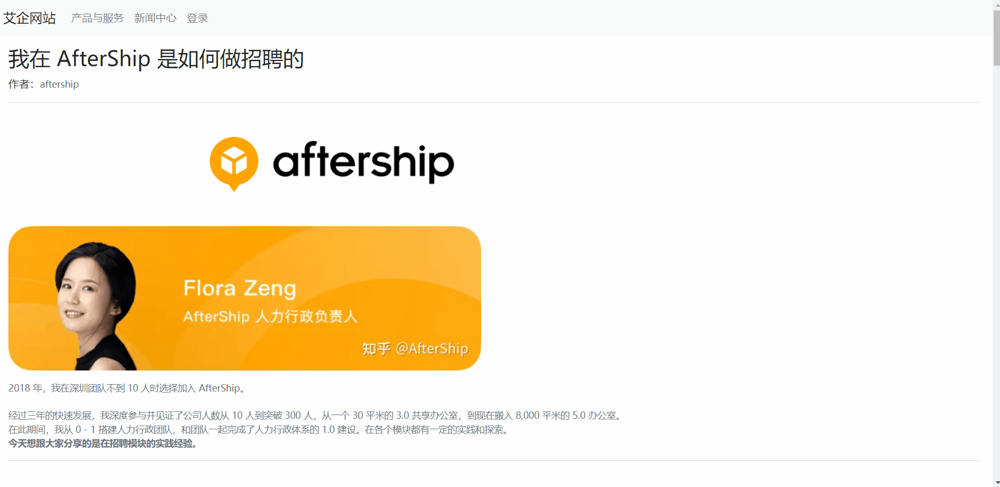

# 艾企网站

## 一、项目介绍及演示 
该项目是一个企业新闻网站，主要面向普通用户简单展示企业资讯、产品等内容。

该项目前端分为admin后台管理端和web网页端，后端采用json-server模拟后端服务器接口。





## 二、admin后台管理端
1. 登录模块
2. 动态加载html
3. 导航栏
4. 侧边栏
5. 首页模块
6. 添加用户
7. 用户列表
8. 编辑用户
9. 删除用户
10. 创建用户
11. 新闻列表
12. 预览新闻
13. 新闻更新
14. 删除新闻
15. 数据分析


## 三、web网页端

1. 导航栏

2. 产品与服务
3. 新闻搜索
4. 新闻列表
5. 新闻分类
6. 新闻详情

## 四、启动

\# 克隆项目到本地仓库

```bash
git clone https://gitee.com/iceliwell/web_js_project.git
```

\# 在VS Code软件中安装Preview on Web Server插件

\# 全局安装json-server

```bash
npm i json-server -g
```

\# 在db目录下启动json-server

```
json-server .\db.json\ --watch
```

